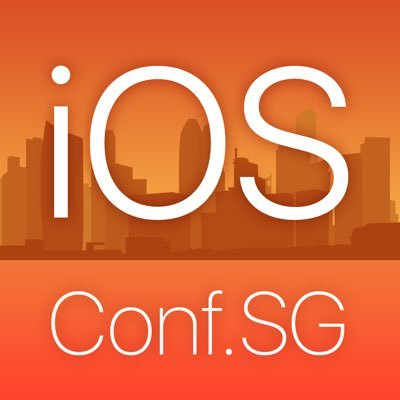

#iOS Conf SG

### Comming soon: It's happening in October

&nbsp;&nbsp;&nbsp;&nbsp;&nbsp;&nbsp;&nbsp;&nbsp;&nbsp;&nbsp;&nbsp;&nbsp;&nbsp;&nbsp;&nbsp;&nbsp;&nbsp;&nbsp;

**iOS Conf SG** aims to bring the iOS developers in this region and the world together. The world’s top iOS developers, bloggers, book authors and trainers are coming together for 2 days. The participants can meet like-minded iOS developers, have fun, learn from one another and find opportunities for collaboration. Attendees come as a group of iOS professionals, students or enthusiasts sharing a common interest to learn and build great iOS apps. 

The main goal of iOS Conf SG is learning something new that we all can use in our day-to-day development practices. The speakers will share their knowledge about iOS tools, technologies and best practices they used when they developed various applications. The mission is that every attendee leaves as a better iOS developer. 

We had an overwhelming response during our pre-registration process. And we do expect to sell out well before the conference date, so you are encouraged to reserve your tickets as early as possible. 

### Tickets: 150 USD
