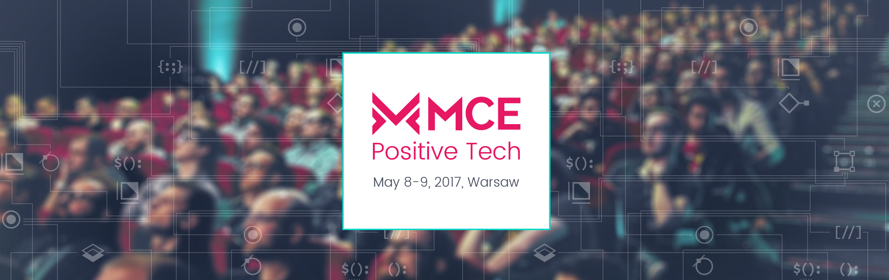

#MCE Positive Tech

### 2 intensive days of absorbing knowledge, inspiring yourself and networking 

Our conference is made by a team of engineers and designers who work together as a good and effective team. We seek for the same positive bunch of talented people and create this event for both of them. You will find lectures devoted to designers and engineers separately, as well as a huge dose of topics suitable for both of them. All combined by positive tech, accessibility and social economy!

&nbsp;&nbsp;&nbsp;&nbsp;&nbsp;&nbsp;&nbsp;&nbsp;&nbsp;

####For Engineers
Engineers at MCE will meet practitioners who work in various areas. The range of topics varies from deep dive into iOS and Android engineering subjects through software craftsmanship and seamless teamwork to emerging technologies such as VR/AR. 

####For Designers
Designers’ track is targeted at true practitioners. The Design Track explores the challenges of UX and UI design, information architecture, service design and design research. Our attendees can be sure that their minds will be blown by talks that challenge their established perspectives. 

### May 8-9, 2017, Warsaw Copernicus Science Centre

You’ll dive into hands-on learning experiences, listen to technical talks, and get a chance to hear more about Google’s latest developer products.

### Tickets: 160 USD